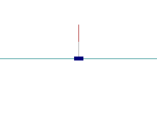
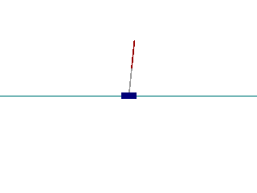

# ROB498-Trajectory-Optimization
The final project of Umich ROB 498: Robot Learning for Planning and Control. In this project, we study the control of a double inverted pendulum on a cart(DIPC) system using different model based trajectory
optimization algorithms - Model Predictive Path Integral (MPPI) and Differential Dynamic Programming (DDP). 

## Installation
To install the required environment and packages, we recommend to use Anaconda and run the following command:

```
conda env create -f environment.yml
conda activate venv 
```

## Running the code

```bash
python main.py
```

## Results
### Random Trajectory
The following figure show the result of the inverted double pendulum system under random actions.

<p align="center">
  
</p>

### MPPI
The following figure show the result of the inverted double pendulum system under MPPI. Our MPPI controller can stabilize the system when the pole angle is not too large.

<p align="center">
  
</p>

### DDP
The following figure show the result of the inverted double pendulum system under DDP. Stay tuned for a better result!

<p align="center">
    
</p>